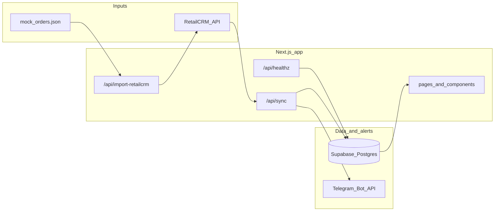

# Architecture

This document is a concise map of how **Retail CRM Analytics Demo** moves data and where responsibilities live. For setup and commands, see [README.md](../README.md).

## High-level flow

1. **Import (offline / demo):** `mock_orders.json` is posted to RetailCRM via the import API layer so the CRM mirrors a realistic order list.
2. **Sync:** Orders are pulled from RetailCRM, normalized, and upserted into Supabase (`orders` + bookkeeping in `sync_runs`).
3. **Read path:** The Next.js dashboard reads from Supabase to render KPIs, charts, and recent rows.
4. **Alerts:** After sync, high-value orders can trigger Telegram notifications with deduplication stored in `order_alerts`.

Production demo UI is read-only; writes use authenticated API routes or server actions only in non-production as documented in the README.

## Diagram

## Module boundaries

| Area | Role |
|------|------|
| [`src/lib/retailcrm.ts`](../src/lib/retailcrm.ts) | HTTP client for RetailCRM REST API. |
| [`src/lib/orders/`](../src/lib/orders/) | Import payload, sync orchestration, mapping to DB rows, alert side effects. |
| [`src/lib/dashboard.ts`](../src/lib/dashboard.ts) | Aggregations for the dashboard from Supabase. |
| [`src/lib/supabase-admin.ts`](../src/lib/supabase-admin.ts) | Service-role Supabase client (server-only). |
| [`src/lib/env.ts`](../src/lib/env.ts) | Zod-validated environment; placeholder detection for “configured vs demo” UX. |
| [`src/app/api/*/route.ts`](../src/app/api/) | Route handlers for import, sync, health. |
| [`supabase/migrations/`](../supabase/migrations/) | Schema for `orders`, `sync_runs`, `order_alerts`. |

## Idempotency and operations

- Upsert keys on `retailcrm_order_id` avoid duplicate rows when sync reruns.
- `sync_runs` records each run for operational visibility (last status, timestamps).
- Telegram deduplication uses `(order_id, threshold)` so repeat syncs do not spam.

## Related reading

- Roadmap and known limitations: [README.md § Roadmap / Ограничения](../README.md)
